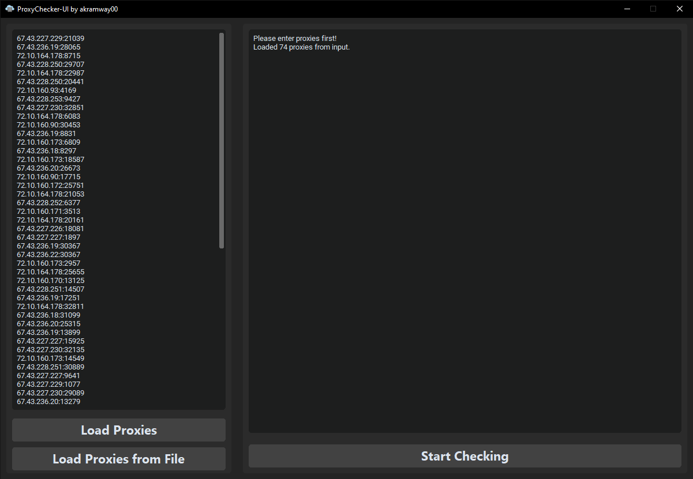
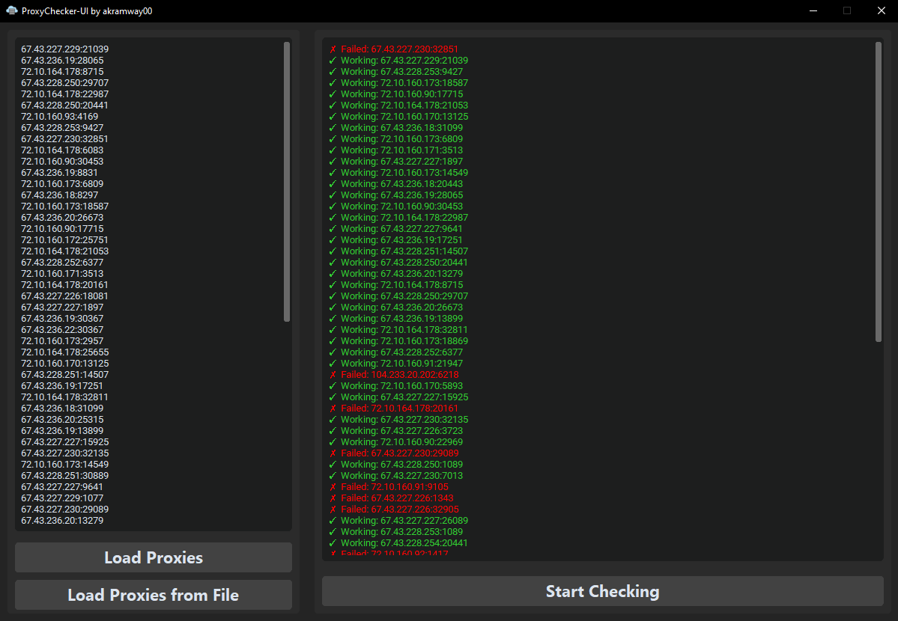

# ModernProxyChecker

A modern and user-friendly Proxy Checker built with **Tkinter** and **customtkinter**. The application allows users to validate a large number of proxies simultaneously using multithreading. Proxies can be loaded either from the clipboard (copy-paste) or a file.

## Features

- **Graphical User Interface (GUI):** A sleek, modern interface powered by Tkinter and customtkinter.
- **Proxy Validation:** Checks if proxies are valid by attempting to connect to a website.
- **Multithreading:** Validates multiple proxies simultaneously for efficiency.
- **Loading Options:** Proxies can be loaded via text input or a file.
- **Real-Time Results:** Displays results of validation (working or failed proxies) in real time.
- **Export Working Proxies:** Saves valid proxies to a text file.
- **Compiled Version:** Includes a pre-compiled `.exe` file for easy usage without requiring Python or dependencies.

## Screenshots

**1. Proxies Loaded but Not Started:**



**2. Real-Time Validation Process:**



## Installation

### Using the Pre-Compiled `.exe` File

1. Locate the `ModernProxyChecker.exe` file in the project directory.
2. Run the `.exe` file to start the application immediately without installing Python or any dependencies.

### Using Python

1. Clone this repository:
   ```bash
   git clone https://github.com/your-username/ModernProxyChecker.git
   cd ModernProxyChecker
   ```

2. Install the required Python packages:
   ```bash
   pip install customtkinter
   ```
3. Ensure Python 3.7 or higher is installed on your system.

4. Run the application:
   ```bash
   python main.py
   ```

## Usage

1. Run the application using either the `.exe` file or Python script.

2. Load proxies:
   - Paste proxies directly into the input box on the left panel.
   - Or use the **Load Proxies from File** button to load a `.txt` file containing proxies.

3. Click **Start Checking** to begin validation. The results will display in real time on the right panel.

4. After validation:
   - Valid proxies are saved to `workingProxies.txt` in the application directory.

## Proxy Format

Proxies should be in the format:
```
IP:Port
```
For example:
```
192.168.1.1:8080
123.45.67.89:3128
```

## How It Works

1. **Validation:** Each proxy is validated by attempting to connect to a website using the `urllib` library.
2. **Multithreading:** The application leverages Python's `ThreadPoolExecutor` for concurrent proxy validation.
3. **Real-Time Updates:** Results are displayed in the GUI as the validation progresses.

## Notes

- The application requires an internet connection for proxy validation.
- Ensure the proxy list is properly formatted to avoid errors.
- For optimal performance, use smaller batches of proxies if the application slows down.

## Future Improvements

- Include options to test proxies for specific websites.
- Enhance error handling for proxy format issues.

## License

This project is licensed under the MIT License. See the LICENSE file for more information.

## Author

Developed by Akramway00.
